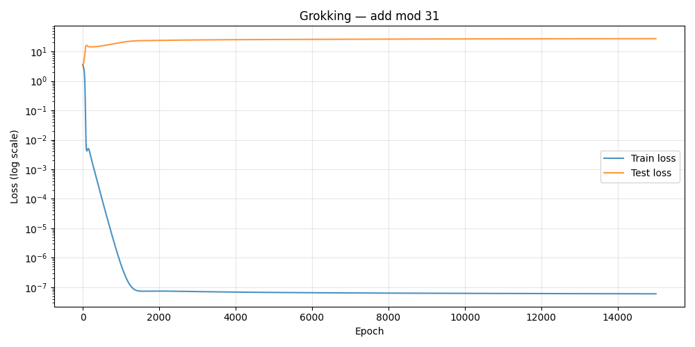

# Part 1: Baseline Grokking

This part reproduces the grokking phenomenon on modular addition `(a + b) mod 31`.
    
The model perfectly memorizes the training data before test loss suddenly collapses thousands of epochs later.

Run `train.py` or `run_grokking.py` to reproduce.
