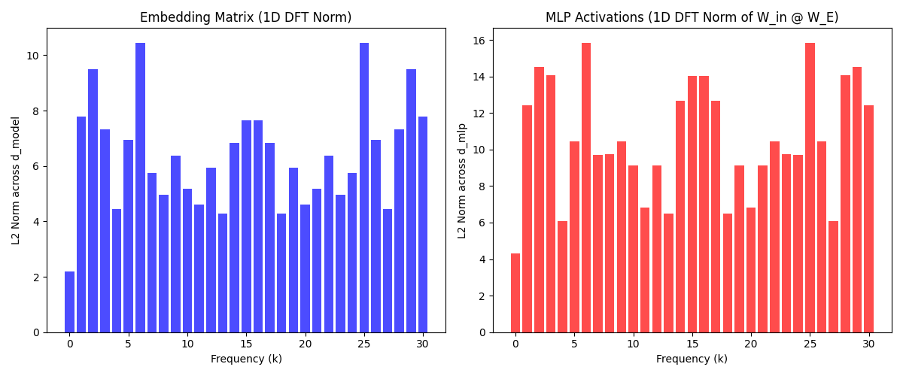

# Part 2: Fourier Sparsity Analysis

This part extracts the learned embedding matrix and MLP activations.
By applying a 1D Discrete Fourier Transform, we demonstrate the network maps inputs to a sparse set of key frequencies.

Run `fourier_analysis.py` to reproduce.
