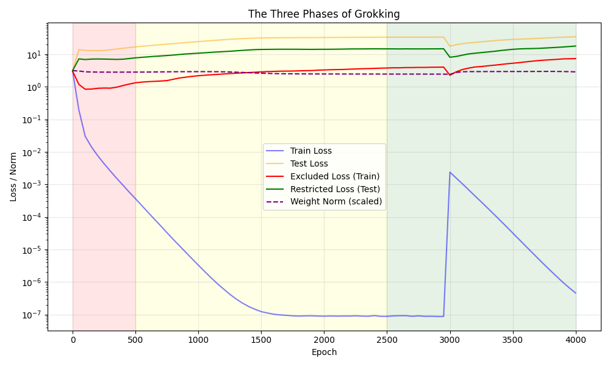

# Part 3: The Three Phases of Grokking

This part tracks restricted and excluded loss metrics alongside weight norms to chart the three distinct phases of grokking: Memorization, Circuit Formation, and Cleanup.

Run `phases_analysis.py` to reproduce.
