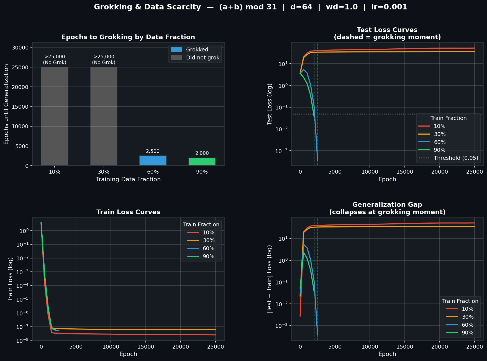

# Part 4: Data Scarcity Regime

This part varies the training data fraction (10%, 30%, 60%, 90%) to demonstrate that grokking only occurs in a specific regime of data scarcity.

Run `fraction_sweep_v2.py` to reproduce.
