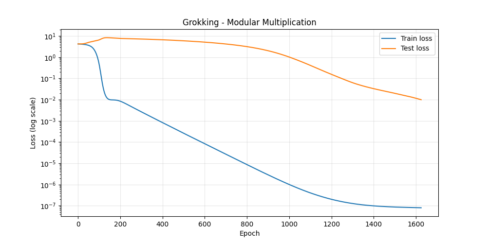
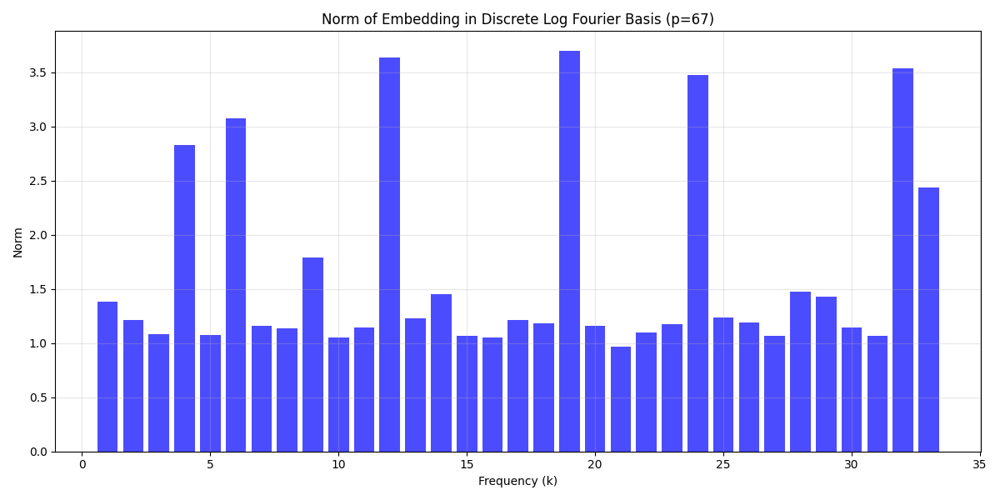
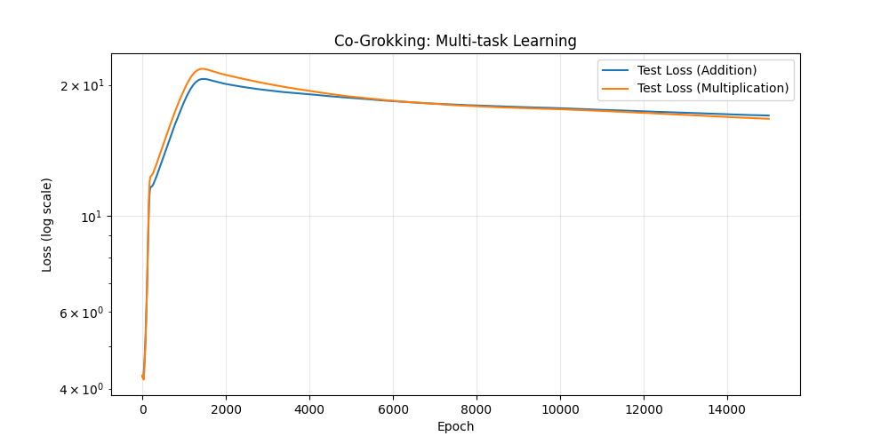

# Part 6: Modular Multiplication & Exponentiation

This part teases out the algorithm that a small transformer learns for modular multiplication.
    
The model maps inputs to a discrete log space, applies an additive Fourier circuit in the exponent, and then projects back. 
This directory also contains the co-grokking study where both addition and multiplication circuits coexist!

Run `discrete_log_analysis.py`, `multiplication_study.py`, and `co_grokking_study.py` to reproduce.
